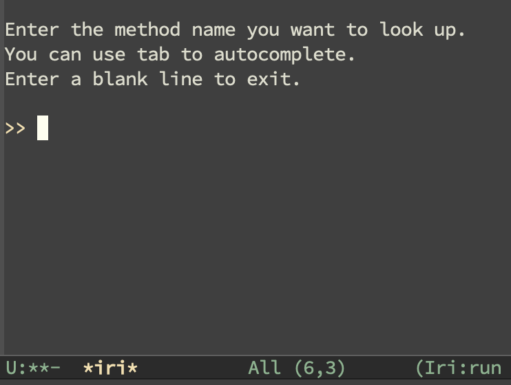

# `iri`

An interactive Emacs front-end for Ruby API reference.

It provides an interactive way to query Ruby API docs.  Under the
hood, it is essentially `comint-mode` running `ri`.
- It is derived from `comint-mode`, so that all those familiar key
  strokes are inherited. (If you don't know `comint-mode`, you may
  know `shell-mode` which is also derived from `comint-mode`).
- It directly calls `ri` (Ruby's built-in command-line tool for API
  reference) instead of dealing with the docs itself, so that
  compatibility is maximized.

## Example Usage

- `M-x iri` to bring up the interactive `*iri*` buffer. 

  

- Input your query.

  

- Input another query.

  

- If the output is too long, you can use `C-c C-r` to goto the head of
  the last output.

  

- Besides `C-c C-r`, all the other `comint-mode` key strokes can be
  used.  For example,
  - `C-c C-p`: jump to the previous output
  - `C-c C-n`: jump to the next output
  - `C-c C-e`: jump back to the input field
  - `M-r`: search previous input
  - `M-p`: previous input
  - `M-n`: next input
  - ... (use `C-h m` to see more!)

## About

I happened to write some *Ruby* code recently.  After years since I
had learned it (but not had been using later), I had to check *Ruby*
docs frequently.  Fortunately *Ruby* was bundled with *ri*, which was
an offline, easy-to-use command-line tool to query *Ruby* APIs.  As an
Emacs user, I soon found myself looking for a front-end for *ri* so
that I could query *ri* without leaving my editor.

I first used [yari.el](https://github.com/hron/yari.el) for a while.
Generally it was a good, popular package (and actually the only
"modern" choice as far as I known).  It retrieves all classes known by
*ri* when it is first invoked.  Then it uses `completing-read` for my
input.

However, I found it NOT as handy as I had expected. The default
completion was not handy enough because it took a *match-first*
strategy.  I had to type the class name before giving the method name
I was looking for.  Otherwise the completion would not match and in
this case *yari* also would not attempt to send the input to *ri* even
though *ri* actually was capable of searching for a method for all
known classes.

Take `strftime` as an example.
- For *yari*: If I typeed "`strftime`" in the *yari* prompt and
  pressed `<RET>`, "`[No match]`" was shown with no further query
  results.
- For the native command-line *ri* tool: If I typed `"ri strftime"` in
  a shell, the docs of `Date.strftime`, `DateTime.strftime`,
  `Time.strftime` was shown.

To the rescue, *yari* could be used with *ido-mode* and was itself
shipped with several shrewd completion systems like *helm* and
*anything*.  Unfortunately, I was not into any complicated completion
systems nor was I to introduce one into my Emacs.

Surprisingly I kinda liked querying the native *ri*.  It was handy
enough to search my input and even smart enough to guess my typo.  For
example, if I typed "`mach`", *ri* replied

	Nothing known about .mach
	Did you mean?  match

Since *ri* was already a good query tool, what I needed was just a
simple front-end talking to an inferior *ri* process.  I liked
`shell-mode`'s way to input, navigate, and search, I decided to
implement an interactive `shell-mode`-like front-end for *ri*.  It
turned out to be really simple and intuitive.  And I named it *iri*.

Hope you enjoy it!
